# Hotel Management System

## Team Members:

	Batch: T3
	111803155  Viren Patil
	111803168  Vrinda Ahuja
	

## Project Description:

This is a small application of a Hotel Management System. The intuition behind building this was that
sometimes it happens that the rooms get booked soon when one visits the place therefore user can make advance booking using this system. It saves user time in searching a room. The system is useful as it calculates an exact cost of rooms for requested number of days. This system is effective and saves time of users as well as the hotel staff and owners.

## Tech Stack Used:

	Programming Languages:
	* Python3
	* Javascript
	* HTML5
	* CSS

	Framework:
	* Django

	Database:
	* Sqlite3

## Application features:  

* **Registration and Login Page**: Any Customer can register an account and then login through the credentials
* **Home Page**: It is the Welcome Page and contains some of the pictures of our Hotel and other links.
* **Room Booking**: A form to book a room in hotel for particular dates.
* **Table Booking**: A form to book a table during your stay.
* **Payment**: Stay details with the total payable bill of the customer. 
* **Feedback**: A feedback form where customer can give rating and feedback of the hotel and their stay. 
* **Gallery**: Hotel Pictures.
* **Contact Us**: Contact Details of Hotel.
* **Customer Profile**: Personal Details of The Customer.
* **Forget Password Functionality**: Customer can Reset the password if he/she forgets it.
* **Logout Page**

## Steps to run the application:
1. Clone the github repository and cd to the folder 
2. Run _pip install -r requirements.txt_
3. Run _cd dbms\_project_
4. Run _python manage.py runserver_

## ER Diagram

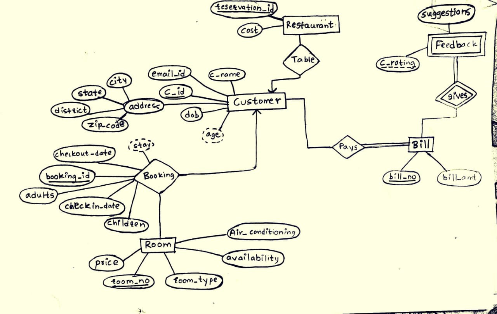

## Relational Schema (After Normalization)

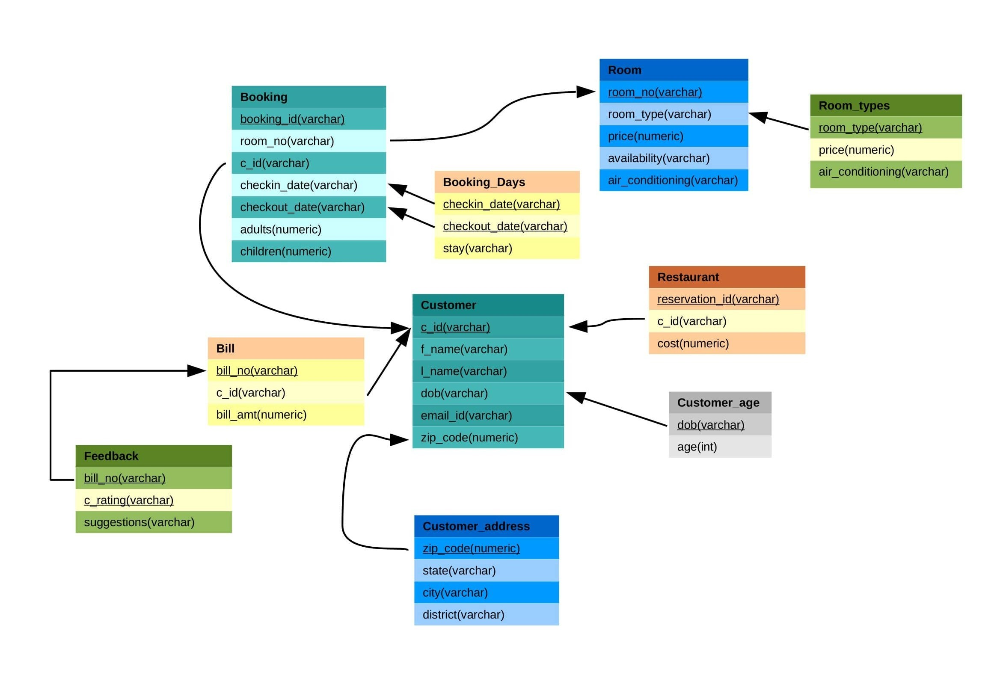

## Admin Side Features:

1. Admin has full permissions and can update database anywhere he wants.
2. Admin can't view customer account passwords.
3. Admin can view Bookings of Rooms as well as Booking of Tables at the restaurant in the hotel.
4. Admin has the authority to cancel any booking due to any reason.
5. Admin has to update the food cost of a particular customer associated with the particular Table Booking.
6. Admin can view the profile information (Username, first name, last name, email, date of birth, state, city, district, zip-code) of the customers.

## User Side Feaures:

1. User can Sign Up to create his/her account.
2. User can Login to his/her account to avail further facilities.
3. User can book a room in the hotel from the available categories.
4. User can book a table in the restaurant only in the period of their stay.
5. User can view the Gallery page for various images of the hotel and its facilities.
6. User can view Payment (Bills) on the Payment Page.
7. User can only book a room after updating the profile page completely.
8. User can view all of their room as well as table bookings.
9. User can cancel their room booking (Note: If a user cancels room booking, all table bookings associated with that booking will get deleted).
10. User can cancel their table booking (Note: Deleting table booking won't affect their room booking status.)

## Some features of the application:-

Registration Page                   |                   Login Page
:---------------------------------:        |      :------------------------------:
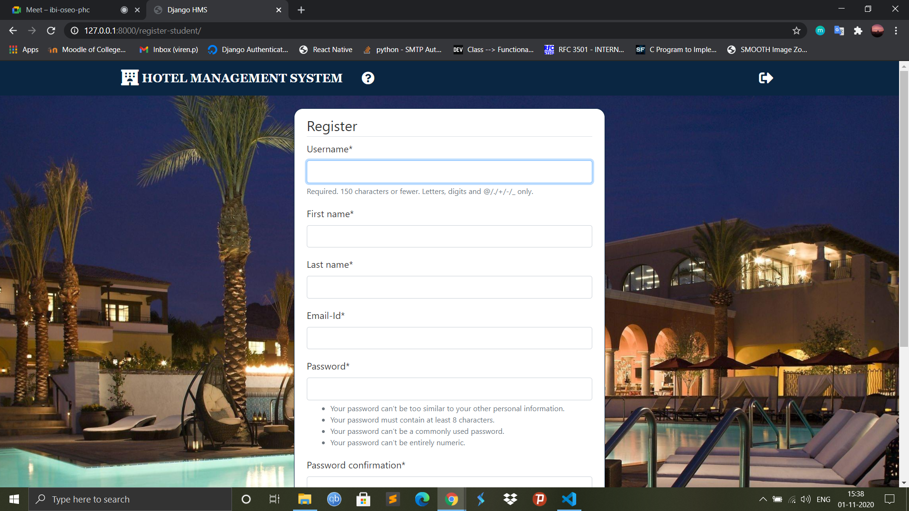  | 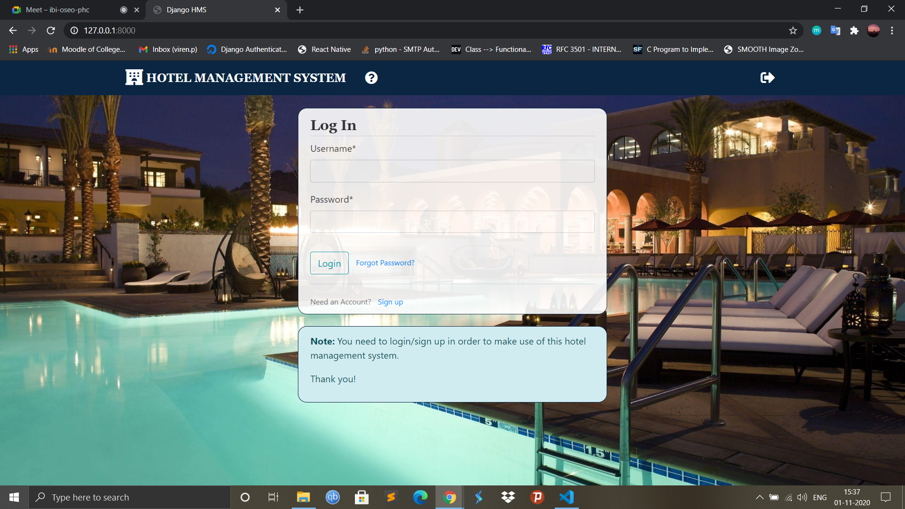

Room Categories(1)                 |                   Room Categories(2)
:---------------------------------:        |      :------------------------------:
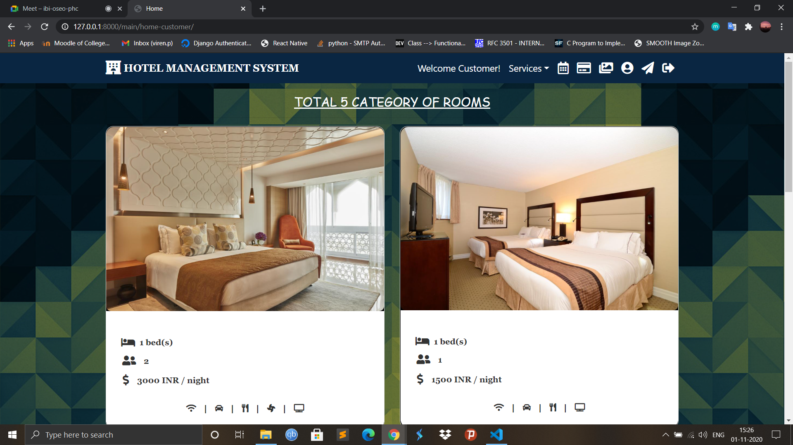     |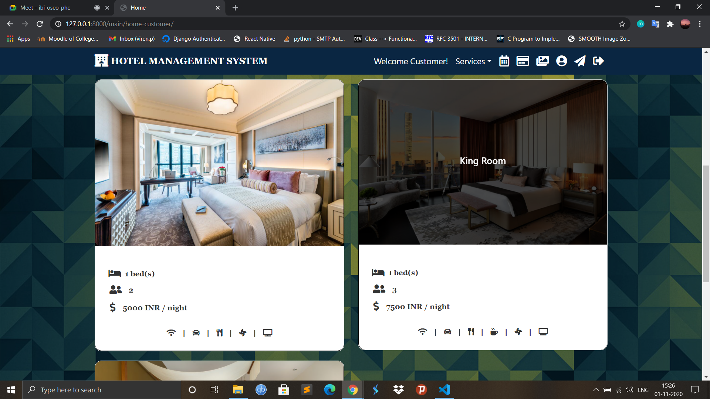

Book a Room                   |                   Book a Table
:---------------------------------:        |      :------------------------------:
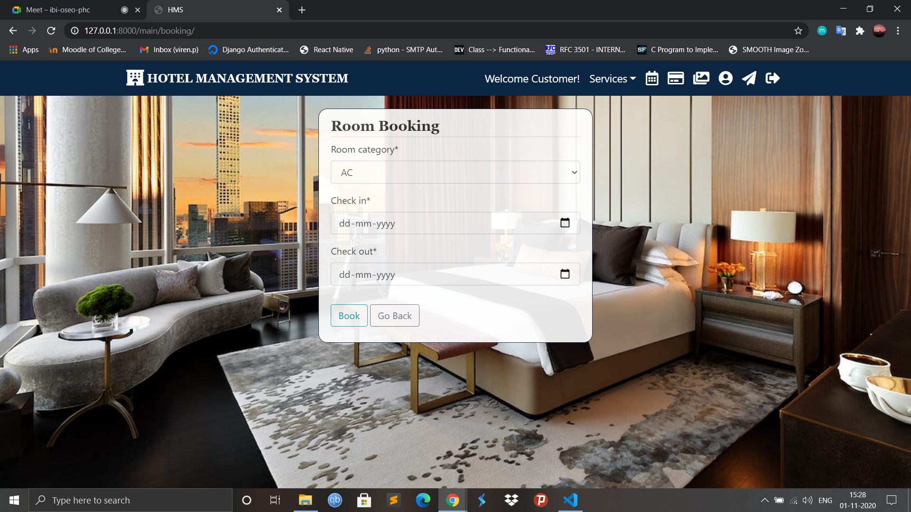     |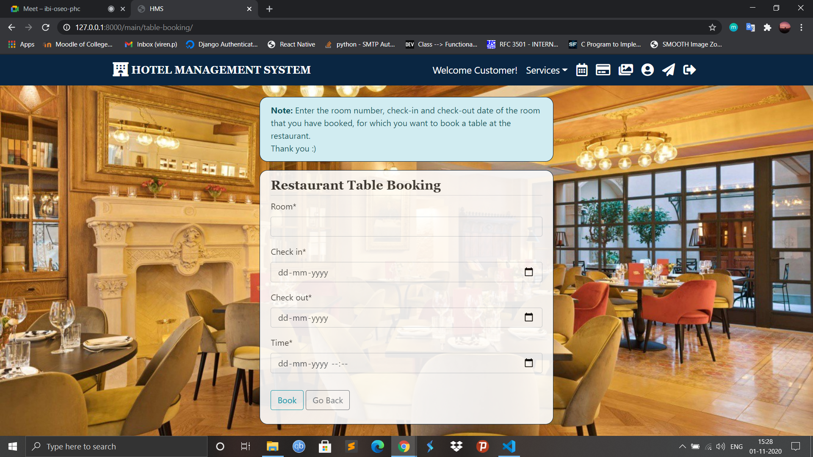

My Room Bookings                   |                   My Table Bookings
:---------------------------------:        |      :------------------------------:
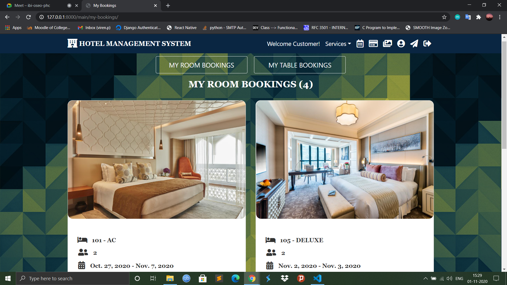     |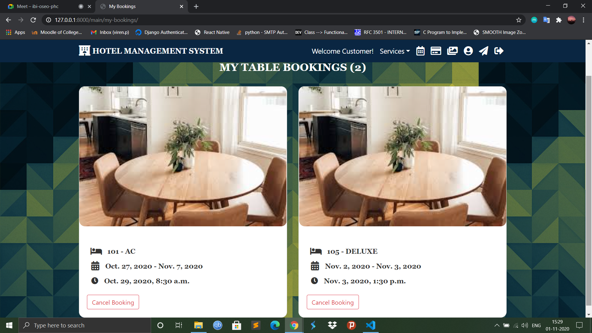

Payment                 |                   Feedback
:---------------------------------:        |      :------------------------------:
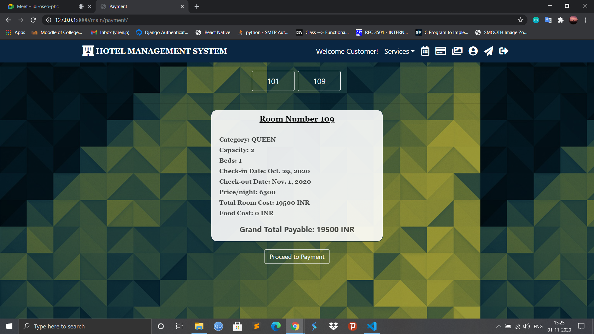     |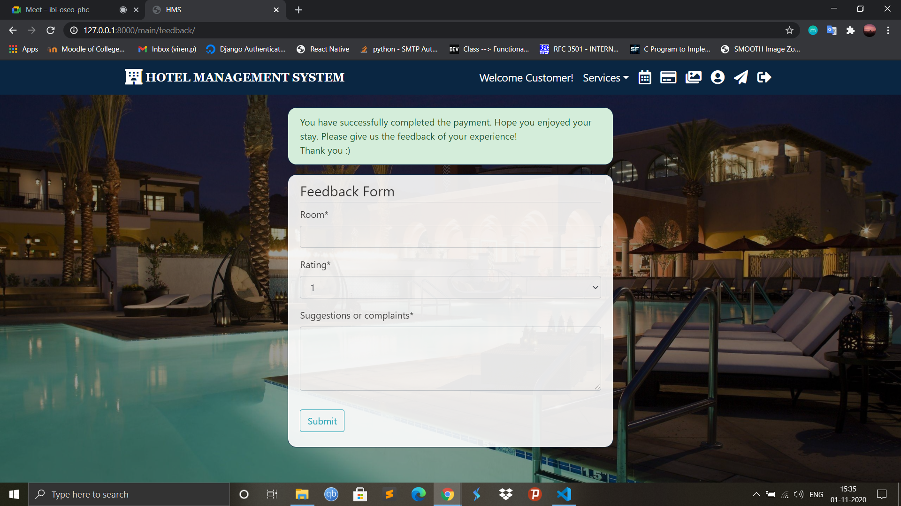

Contact Us                 |                   Gallery
:---------------------------------:        |      :------------------------------:
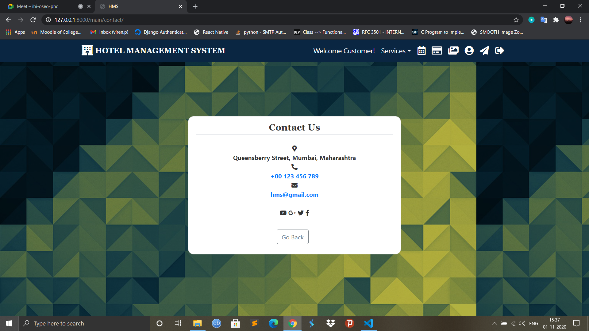     |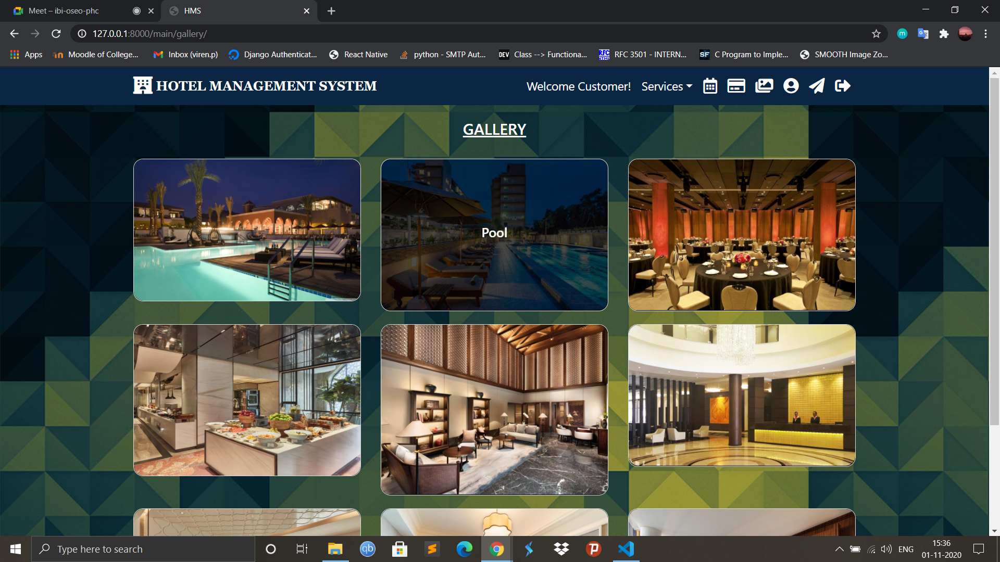

Welcome Page               |                   Logout Page
:---------------------------------:        |      :------------------------------:
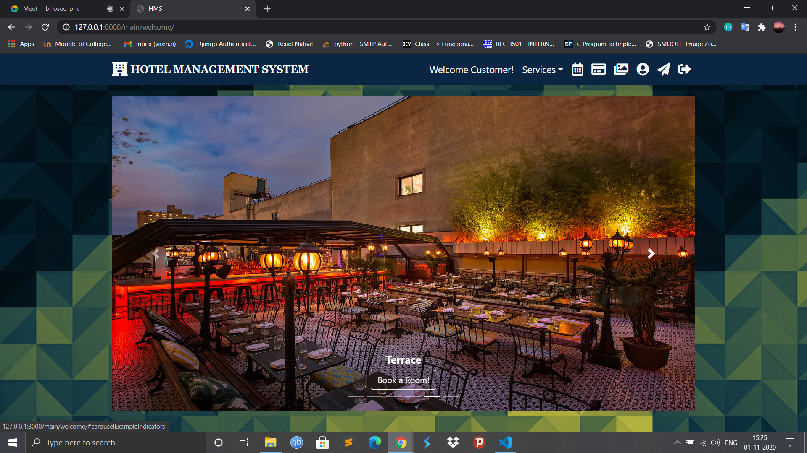     |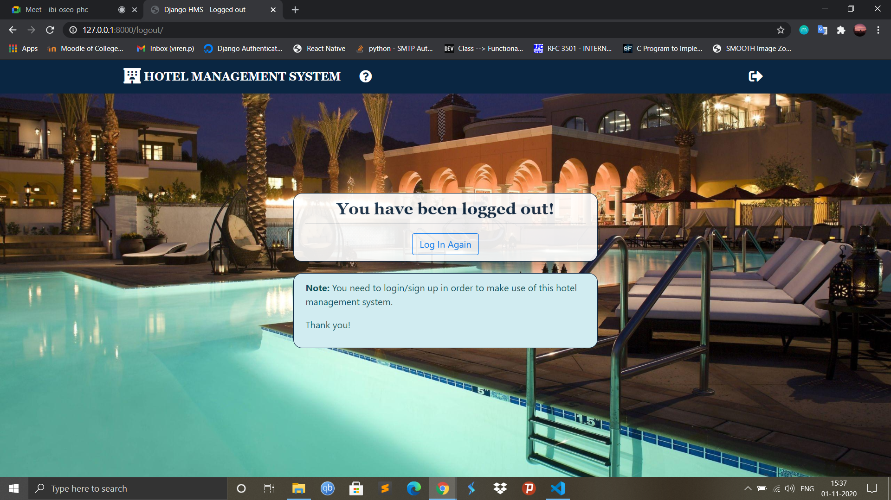

